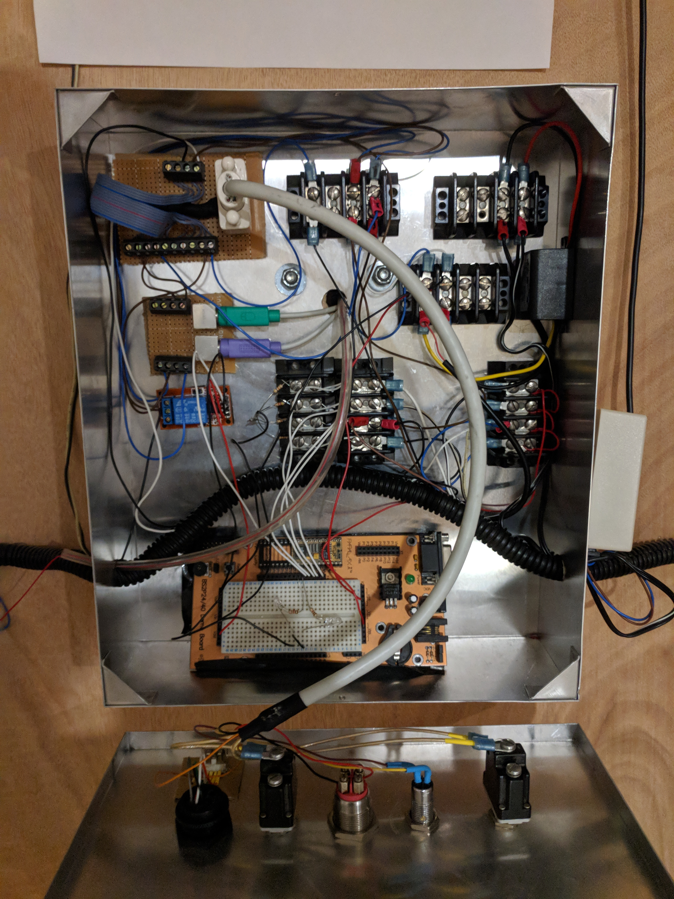

# Door Lock

An over complicated basic stamp run door lock. This this is wacky and not the best way to accomplish a door lock, but here it is. I started out with a keypad from a plastic safe and utilized this and its circuit board to send signals to the basic stamp which unlocks the door. I also added a button under my desk that unlocks the door wirelessly, makes me feel like a mafia boss.

 